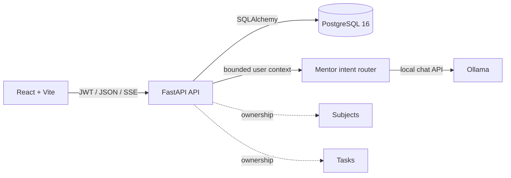

# ???

<p align="center">
  <a href="https://github.com/worhels/CyberLab-Tracker/actions/workflows/ci.yml">
    
  </a>
  <a href="https://github.com/worhels/CyberLab-Tracker/actions/workflows/codeql.yml">
    
  </a>
  
  
  
  
</p>

??? is a full-stack application for managing academic subjects,
tasks, deadlines, task status, and workload metrics. The backend enforces
per-user ownership. The frontend provides task workflows, dashboard metrics,
Crisis Mode, data export, and an Ollama-backed assistant.

## Stack

| Layer | Technology |
| --- | --- |
| Backend | FastAPI, SQLAlchemy 2, Alembic, Pydantic |
| Frontend | React 19, TypeScript, Vite, React Router, Tailwind CSS |
| Database | PostgreSQL 16 |
| Local AI | Ollama, intent routing, SSE streaming |
| UI | Framer Motion, Three.js, React Three Fiber, Lucide |
| Tooling | Docker Compose, PowerShell, GitHub Actions |

## Features

| Surface | What it does |
| --- | --- |
| Dashboard | Progress, nearest deadline, overdue count, priority queue, subject progress, recent activity |
| Subjects | Per-user CRUD, teacher and semester metadata, workload statistics, task creation |
| Tasks | Search, status/priority/type/deadline filters, pagination, responsive cards, status updates |
| Crisis Mode | Ranks unfinished work by deadline pressure, debt, priority, effort, and task type |
| CyberMentor | Answers from ownership-safe backend context, detects intent and language, streams responses |
| Settings | Theme, language, accent, density, motion, deadline reminders, visual performance controls |
| Export | Authenticated per-user JSON and UTF-8 CSV downloads |
| Auth | Registration, login, JWT access tokens, protected routes, generic auth errors, rate limiting |

Task state is explicit:

```text
ACTIVE    not_started / in_progress / debt / derived overdue
REVIEW    submitted
DONE      accepted
```

`accepted` is never treated as active. `overdue` is derived from an unfinished
task's deadline; it is not stored as a separate database status.

## CyberMentor

CyberMentor is a local Ollama-powered assistant embedded in the app shell.

Routing priority:

```text
message intent → backend context → selected preset → current page
```

That means a user can stay on Dashboard and ask `Покажи активные лабы`; Mentor
will query the user's tasks, separate active work from accepted work, and answer
with data instead of navigation instructions.

Current intents include active labs and tasks, deadlines, task status,
current-task help, reports, conclusions, code debugging, architecture, and UI
review. RU, UK, and EN are detected from the latest message.

Presets define the default response structure. Detected intent has higher
priority than the selected preset.

| Preset | Response shape |
| --- | --- |
| Chat | Direct answer |
| Lab | Actions → solution → conclusion |
| Code | Problem → cause → fix → verification |
| Report | Paste-ready document text |
| Deadline | Minimum viable submission plan |

Security boundary:

- Mentor never receives direct SQL access.
- Task and subject context is filtered by the authenticated user.
- Foreign `task_id` and `subject_id` values are rejected.
- ORM objects are reduced to bounded JSON context packets.
- Completed exchanges are persisted; incomplete streams are not.
- Ollama downtime returns a user-safe `503`.

## Quick Start

### Requirements

- Docker Desktop
- Node.js 20+
- PowerShell
- Ollama with `qwen2.5-coder:7b` — optional, required only for CyberMentor

Clone and start:

```powershell
git clone https://github.com/worhels/CyberLab-Tracker.git
Set-Location CyberLab-Tracker
.\scripts\dev.ps1
```

The script creates local env files, generates development secrets, builds
PostgreSQL and the backend, applies Alembic migrations, seeds demo data, installs
frontend packages, and starts Vite.

Open:

| Service | URL |
| --- | --- |
| App | [http://localhost:5173](http://localhost:5173) |
| API health | [http://localhost:8000/health](http://localhost:8000/health) |
| Swagger, when `DEBUG=true` | [http://localhost:8000/docs](http://localhost:8000/docs) |

Demo account:

```text
demo@cyberlab.dev
password123
```

Useful startup variants:

```powershell
.\scripts\dev.ps1 -NoSeed
.\scripts\dev.ps1 -SkipInstall
.\scripts\dev.ps1 -BackendOnly
.\scripts\dev.ps1 -ResetDb
```

For the full local workbench — backend, database snapshots, VS Code workspace,
and frontend terminal — use:

```powershell
.\start.ps1
```

### Enable CyberMentor

Pull the configured local model:

```powershell
ollama pull qwen2.5-coder:7b
```

Docker reaches Ollama through `host.docker.internal`. Defaults are defined in
`docker-compose.yml` and can be overridden with:

```env
OLLAMA_CHAT_URL=http://host.docker.internal:11434/api/chat
OLLAMA_MODEL=qwen2.5-coder:7b
OLLAMA_TIMEOUT_SECONDS=120
OLLAMA_WARMUP_ENABLED=true
```

## Architecture



The backend is the source of truth. The frontend sends page/task hints; Mentor
detects intent independently and requests only the data needed for that intent.

| Path | Responsibility |
| --- | --- |
| `backend/app` | API, queries, models, schemas, security |
| `backend/alembic` | Database migrations |
| `frontend/src` | Pages, components, typed API clients, Mentor stream |
| `scripts` | Local startup and workbench automation |
| `docs` | Architecture, API, security, development |

## Security And Quality

### Security

- JWT claim validation, fixed algorithm, bcrypt, generic auth errors
- login and registration rate limits
- explicit CORS and debug-only API docs
- ownership checks on subjects, tasks, exports, and Mentor context
- required Docker secrets kept outside Git

Details:
[Security model](docs/SECURITY_MODEL.md) ·
[Threat model](docs/THREAT_MODEL.md) ·
[Security policy](SECURITY.md)

### Quality Gates

GitHub Actions runs:

```text
backend   Ruff → pytest → compileall
frontend  TypeScript → ESLint → production build
security  CodeQL → dependency review
```

Run the same checks locally:

```powershell
python -m pip install -r backend\requirements-dev.txt
python -m ruff check backend
python -m pytest -q
npm --prefix frontend run typecheck
npm --prefix frontend run lint
npm --prefix frontend run build
```

Environment templates live in [.env.example](.env.example),
[backend/.env.example](backend/.env.example), and
[frontend/.env.example](frontend/.env.example). The startup script creates the
local files automatically.

## Documentation

- [Architecture](docs/ARCHITECTURE.md)
- [API overview](docs/API_OVERVIEW.md)
- [Development guide](docs/DEVELOPMENT.md)
- [Security model](docs/SECURITY_MODEL.md)
- [Threat model](docs/THREAT_MODEL.md)
- [Branching model](docs/BRANCHING.md)
- [Roadmap](ROADMAP.md)
- [Changelog](CHANGELOG.md)

## License

MIT — see [LICENSE](LICENSE).
