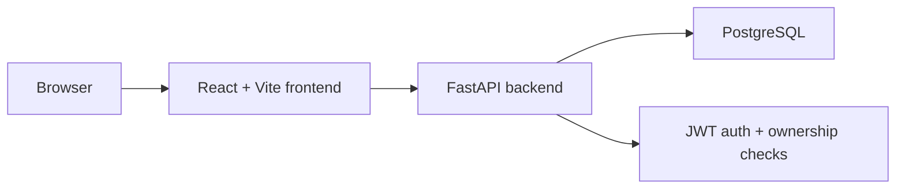

# CyberLab Tracker

[](https://github.com/worhels/CyberLab-Tracker/actions/workflows/ci.yml)
[](https://github.com/worhels/CyberLab-Tracker/actions/workflows/codeql.yml)

CyberLab Tracker is a full-stack local-first academic workload tracker built
with FastAPI, PostgreSQL, React, TypeScript, Docker, and GitHub Actions.

The project is now a practical daily-use study control center with a hardened
backend, a themeable React workspace, persisted user settings, workload
visualizations, and portfolio-grade documentation. It tracks subjects, academic
tasks, deadlines, debts, workload pressure, completion progress, and
crisis-level task priority.

## Overview

CyberLab Tracker helps organize academic work by showing:

- active subjects and their study metadata
- pending labs, coursework, reports, and checkpoints
- overdue tasks and nearest deadline pressure
- task priority, type, status, estimates, and external links
- completion progress across the whole workspace
- subject progress and recent activity
- crisis-level workload with ranked active tasks
- visual workload state through the Crisis Volume Cube and workload hotspots
- a persisted interface profile with language, theme, accent, density, and
  motion preferences

This is not positioned as a generic cybersecurity product. The security scope is
application hardening for a realistic full-stack productivity app.

## Why This Project Exists

The goal is to show a complete engineering workflow rather than only a UI demo:

- backend API design with authenticated ownership checks
- database schema and migrations
- local Docker development environment
- frontend application workflow with protected routes and persisted settings
- themeable UI system with route-aware visual backgrounds
- security policy and threat model
- CI quality gates
- maintainable repository structure

## Features

- Email/password authentication with JWT access tokens and protected routes
- Subject CRUD with teacher, semester, color, and description fields
- Task CRUD with status, priority, type, deadlines, estimates, GitHub/Moodle
  links, report references, and status updates
- Unified subject/task intake page
- Tasks workspace with search, priority/type filters, list modes, pagination,
  animated rows, and subject cards
- Dashboard summary with progress, nearest deadline, priority queue, subject
  progress, and recent activity
- Crisis Mode ranking for high-risk active tasks
- Crisis Volume Cube with active/accepted pressure metrics
- Workload sphere/hotspot visualization for task distribution by subject
- Persistent user settings for language, theme, accent color, dashboard density,
  Crisis Cube visibility, reduced motion, and deadline reminder preference
- Zerkalo, dark, light, and system theme support with normalized light-theme UI
- Route-aware pressure-field backgrounds, collapsible sidebar, and mobile nav
- Demo seed data for local review
- Docker Compose setup for PostgreSQL and backend
- One-command local development script for Windows

## Security Focus

CyberLab Tracker is intentionally not designed as an enterprise SaaS. The
security scope is focused on practical application hardening:

- JWT validation with explicit algorithm and required claims
- bcrypt password hashing
- generic authentication errors
- login/register rate limiting
- CORS hardening
- Docker secret handling
- IDOR prevention through per-user data access checks
- local-first data safety
- documented threat model and known boundaries

See [SECURITY.md](SECURITY.md), [docs/SECURITY_MODEL.md](docs/SECURITY_MODEL.md),
and [docs/THREAT_MODEL.md](docs/THREAT_MODEL.md).

## Tech Stack

| Area | Stack |
| --- | --- |
| Backend | FastAPI, SQLAlchemy 2, Alembic, Pydantic |
| Database | PostgreSQL 16 |
| Frontend | React, TypeScript, Vite, React Router |
| UI and visuals | Tailwind CSS, design tokens, Three.js, React Three Fiber, Framer Motion, Lucide |
| Tooling | Docker Compose, PowerShell scripts, GitHub Actions |
| Security | JWT auth, bcrypt hashing, CORS policy, auth rate limiting, ownership checks |

## Current Project State

As of June 25, 2026, the implemented product surface includes:

- Login and registration flows with a generative auth visual
- Authenticated app shell with desktop sidebar, mobile navigation, and route
  transitions
- Dashboard, Subjects, Tasks, Crisis Mode, and Settings pages
- Persisted settings API and frontend settings context
- Multilingual UI labels for Russian, Ukrainian, and English in the settings
  flow and app shell
- Zerkalo-first theme system with dark, light, and system modes
- Light-theme normalization so the dark visual layer no longer leaks into the
  light UI
- Backend tests for JWT claims, token validation behavior, crisis metrics, and
  user settings defaults/updates

## Screenshots

Fresh screenshots are still pending. Capture them after the current UI pass is
visually verified on desktop and mobile.

## Architecture



More detail: [docs/ARCHITECTURE.md](docs/ARCHITECTURE.md).

## Quick Start

Run everything from the project root:

```powershell
.\scripts\dev.ps1
```

If PowerShell blocks local scripts:

```powershell
powershell -ExecutionPolicy Bypass -File .\scripts\dev.ps1
```

The script will:

- create `.env` and `frontend/.env` when missing
- generate local `POSTGRES_PASSWORD` and `JWT_SECRET_KEY` values
- start PostgreSQL and the FastAPI backend with Docker Compose
- apply Alembic migrations
- seed the demo user and demo data
- install frontend dependencies
- start the Vite frontend

Open:

- App: [http://localhost:5173](http://localhost:5173)
- API health: [http://localhost:8000/health](http://localhost:8000/health)

Demo account:

- Email: `demo@cyberlab.dev`
- Password: `password123`

## Environment Variables

Root `.env` is created from `.env.example`.

| Variable | Purpose |
| --- | --- |
| `POSTGRES_DB` | Local PostgreSQL database name |
| `POSTGRES_USER` | Local PostgreSQL user |
| `POSTGRES_PASSWORD` | Required local database password |
| `BACKEND_PORT` | Host port for the backend container |
| `DEBUG` | Enables API docs when `true` |
| `JWT_SECRET_KEY` | Required signing secret for JWT tokens |
| `JWT_ALGORITHM` | JWT signing algorithm |
| `ACCESS_TOKEN_EXPIRE_MINUTES` | Access token lifetime |
| `CORS_ORIGINS` | Allowed frontend origins |

Frontend `.env` is created from `frontend/.env.example` and contains:

```env
VITE_API_BASE_URL=http://localhost:8000/api/v1
```

## Development Workflow

Useful local commands:

```powershell
.\scripts\dev.ps1 -ResetDb
.\scripts\dev.ps1 -NoSeed
.\scripts\dev.ps1 -SkipInstall
.\scripts\dev.ps1 -BackendOnly
```

Frontend checks:

```powershell
cd frontend
npm ci
npm run typecheck
npm run lint
npm run build
```

Backend checks:

```powershell
cd backend
python -m pip install -r requirements-dev.txt
ruff check .
pytest
```

More detail: [docs/DEVELOPMENT.md](docs/DEVELOPMENT.md).

## Quality Gates

GitHub Actions runs:

- backend dependency install
- Ruff check
- backend tests
- backend compile check
- frontend dependency install
- TypeScript typecheck
- frontend lint
- frontend production build
- CodeQL analysis
- dependency review on pull requests

## Roadmap

Current focus:

- finish destructive-action confirmations and deadline quick filters
- add broader auth/ownership integration tests
- capture final screenshots for the repository
- continue small UI polish and performance fallback work
- keep documentation aligned with implemented behavior

See [ROADMAP.md](ROADMAP.md).

## API Docs

API docs are only enabled when `DEBUG=true`.

Set this in `.env`:

```env
DEBUG=true
```

Restart backend:

```powershell
docker compose restart backend
```

Then open:

- Swagger UI: [http://localhost:8000/docs](http://localhost:8000/docs)
- OpenAPI JSON: [http://localhost:8000/openapi.json](http://localhost:8000/openapi.json)

## Branching Model

- `main` is stable and release-ready.
- `develop` is the integration branch.
- `feature/<scope>` is for product work.
- `fix/<scope>` is for bug fixes.
- `chore/<scope>` is for tooling, documentation, and maintenance.

See [docs/BRANCHING.md](docs/BRANCHING.md).

## Security Policy

See [SECURITY.md](SECURITY.md).

## License

This project is released under the MIT License. See [LICENSE](LICENSE).
