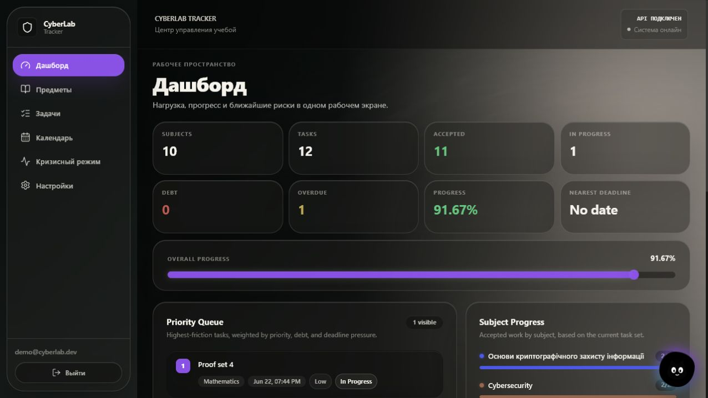
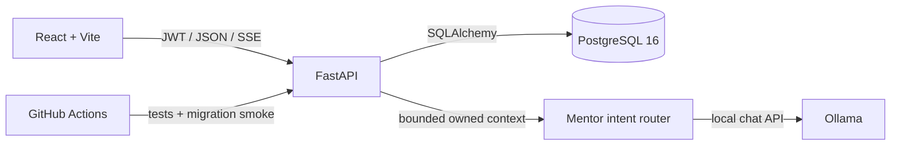

# CyberLab Tracker

<p align="center">
  
</p>

<p align="center">
  <a href="https://github.com/worhels/CyberLab-Tracker/actions/workflows/ci.yml"></a>
  <a href="https://github.com/worhels/CyberLab-Tracker/actions/workflows/codeql.yml"></a>
  <a href="./LICENSE"></a>
  
  
  
</p>

CyberLab Tracker is a local-first study workload control center for subjects,
deadlines, lab debt, and submission progress. It combines an ownership-safe
FastAPI API with a responsive React interface, a ranked Crisis Mode, a list
calendar, exports, and an optional local Ollama mentor.

> **Beta status:** suitable for local use and controlled self-hosted testing.
> Public internet deployment still requires TLS, a trusted reverse proxy,
> persistent distributed rate limiting, monitoring, backups, and an explicit
> privacy policy. See the [security model](docs/SECURITY_MODEL.md).

## Product tour



## What is included

- **Complete study CRUD:** create, read, edit, and delete subjects and tasks;
  nullable metadata can be cleared intentionally.
- **Deadline control:** search, filters, responsive task cards, local-date
  calendar groups, overdue/today signals, and a separate no-deadline queue.
- **Crisis Mode:** ranks active and debt work by deadline pressure, priority,
  effort, type, and status.
- **Secure-by-default auth:** direct bcrypt hashing, fixed HS256 JWT validation,
  required claims, generic login errors, auth rate limiting, and ownership
  filtering for every user-owned resource.
- **Workspace tools:** JSON/CSV export, persisted theme/language/motion settings,
  and an optional ownership-bounded CyberMentor backed by local Ollama.
- **Quality gates:** Ruff, strict Pyright, backend regression tests, strict
  TypeScript, frontend unit tests, ESLint, production build, CodeQL, dependency
  review, and PostgreSQL migration checks.

## Stack

| Layer | Technology |
| --- | --- |
| API | FastAPI, Pydantic, PyJWT, bcrypt |
| Data | PostgreSQL 16, SQLAlchemy 2, Alembic |
| Web | React 19, strict TypeScript, Vite, React Router |
| UI | Framer Motion, Three.js, React Three Fiber, design tokens |
| Local AI | Ollama, intent routing, bounded context, SSE |
| Tests and CI | Pytest, Pyright, Ruff, Vitest, Testing Library, GitHub Actions |

## Quick start

Requirements: Docker Desktop, Node.js 20+, npm, PowerShell, and optionally
Ollama for CyberMentor.

```powershell
git clone https://github.com/worhels/CyberLab-Tracker.git
Set-Location CyberLab-Tracker
.\scripts\dev.ps1
```

The script creates ignored local environment files, generates development
secrets, starts PostgreSQL and the API, applies Alembic migrations, seeds demo
data, installs frontend packages, and starts Vite.

| Service | Address |
| --- | --- |
| Web app | [http://localhost:5173](http://localhost:5173) |
| API health | [http://localhost:8000/health](http://localhost:8000/health) |
| Swagger | [http://localhost:8000/docs](http://localhost:8000/docs), only with `DEBUG=true` |

Development-only demo credentials:

```text
demo@cyberlab.dev
password123
```

Useful variants:

```powershell
.\scripts\dev.ps1 -NoSeed
.\scripts\dev.ps1 -SkipInstall
.\scripts\dev.ps1 -BackendOnly
.\scripts\dev.ps1 -ResetDb
```

To enable CyberMentor:

```powershell
ollama pull qwen2.5-coder:7b
```

## Architecture



The backend is the source of truth for ownership, UTC timestamps, dashboard
metrics, and Crisis scoring. The frontend renders dates in the user's local
calendar and never decides access control. Details are in
[Architecture](docs/ARCHITECTURE.md) and [API overview](docs/API_OVERVIEW.md).

## Configuration

Copy the templates only when not using the startup script:

```powershell
Copy-Item .env.example .env
Copy-Item frontend\.env.example frontend\.env
```

Use a random `JWT_SECRET_KEY` of at least 32 characters. JWT uses a fixed
`HS256` algorithm; it is deliberately not environment-selectable. Passwords
are limited by bcrypt's 72-byte input boundary and hashing cost is controlled by
`BCRYPT_ROUNDS`.

## Run the quality gates

```powershell
python -m pip install -r backend\requirements-dev.txt
python -m ruff check backend
pyright
python -m pytest -q
npm --prefix frontend ci
npm --prefix frontend test
npm --prefix frontend run typecheck
npm --prefix frontend run lint
npm --prefix frontend run build
npm --prefix frontend audit
```

CI also applies the full Alembic chain to PostgreSQL 16, checks model/migration
parity, downgrades to base, and upgrades to head again.

## Documentation

- [Roadmap](ROADMAP.md)
- [Architecture](docs/ARCHITECTURE.md)
- [API overview](docs/API_OVERVIEW.md)
- [Development guide](docs/DEVELOPMENT.md)
- [Security model](docs/SECURITY_MODEL.md)
- [Threat model](docs/THREAT_MODEL.md)
- [Beta release checklist](docs/BETA_RELEASE.md)
- [Security policy](SECURITY.md)
- [Changelog](CHANGELOG.md)
- [Contributing](CONTRIBUTING.md)

## License

The project source is available under the [MIT License](LICENSE). MIT permits
use, modification, redistribution, sublicensing, and commercial use when the
copyright and permission notice are retained. A software license does not
replace deployment security, privacy obligations, trademark review, or
third-party asset/model license checks.
