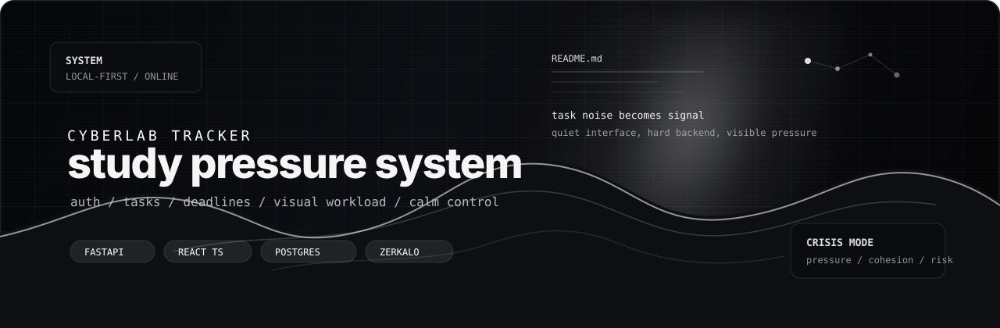
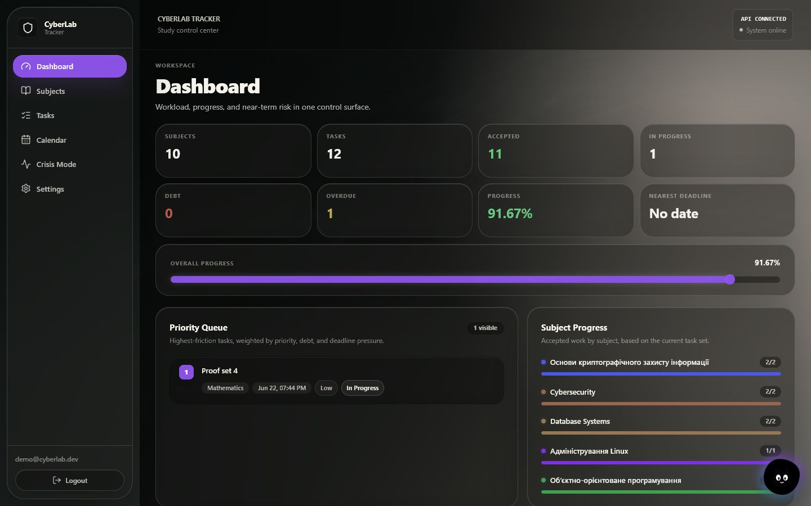
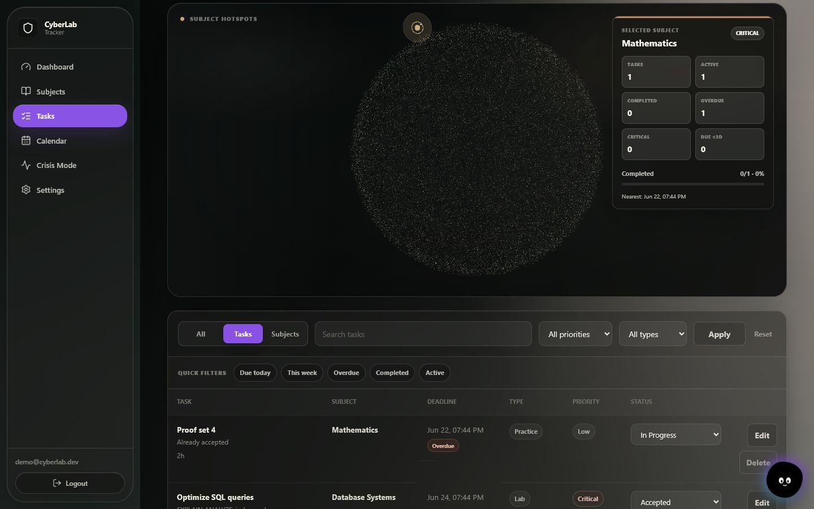
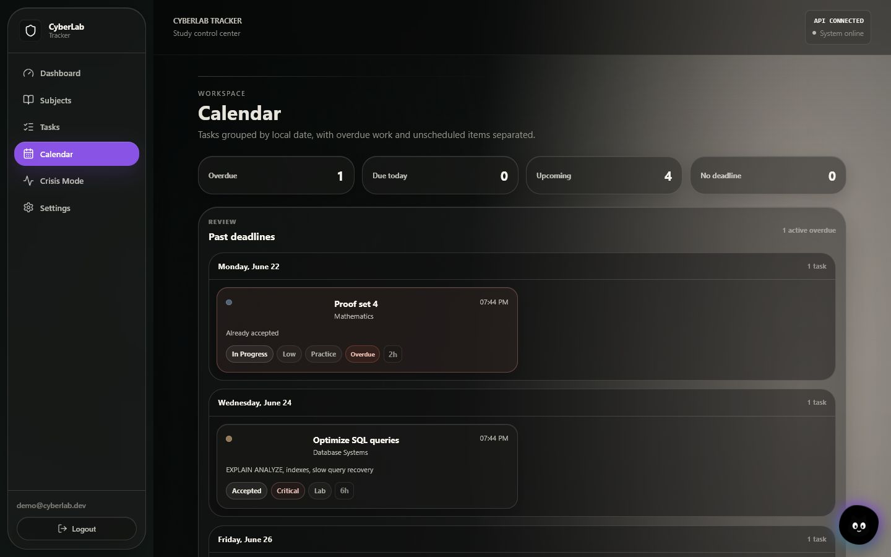
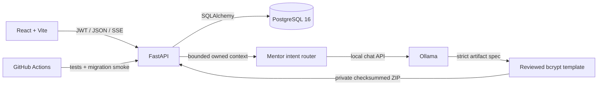

# CyberLab Tracker

<p align="center">
  
</p>

<p align="center">
  <a href="https://github.com/worhels/CyberLab-Tracker/actions/workflows/ci.yml"></a>
  <a href="https://github.com/worhels/CyberLab-Tracker/actions/workflows/codeql.yml"></a>
  <a href="https://github.com/worhels/CyberLab-Tracker/releases"></a>
  <a href="./LICENSE"></a>
  
  
  
</p>

CyberLab Tracker is a local-first study workload control center for subjects,
deadlines, lab debt, and submission progress. It combines an ownership-safe
FastAPI API with a responsive React interface, a ranked Crisis Mode, a list
calendar, exports, and an optional local Ollama mentor.

> **Local-first status:** intended for local use. Public internet deployment
> and hosted-service operation are outside the project scope.

## Product tour

| Dashboard | Tasks | Calendar |
| --- | --- | --- |
|  |  |  |

## What is included

- **Complete study CRUD:** create, read, edit, and delete subjects and tasks;
  nullable metadata can be cleared intentionally.
- **Deadline control:** search, filters, responsive task cards, local-date
  calendar groups, overdue/today signals, and a separate no-deadline queue.
- **Crisis Mode:** ranks active and debt work by deadline pressure, priority,
  effort, type, and status.
- **Secure-by-default auth:** direct bcrypt hashing, fixed HS256 JWT validation,
  required claims, generic login errors, auth rate limiting, and ownership
  filtering for every user-owned resource.
- **Workspace tools:** JSON/CSV export, persisted theme/language/motion settings,
  and an optional ownership-bounded CyberMentor backed by local Ollama.
- **Reviewed AI artifact:** the artifact API turns a strict Ollama specification
  into an isolated, checksummed bcrypt timing web prototype and downloadable ZIP.
  The model never receives a shell or arbitrary filesystem access.
- **Quality gates:** Ruff, strict Pyright, backend regression tests, strict
  TypeScript, frontend unit tests, ESLint, production build, CodeQL, dependency
  review, and PostgreSQL migration checks.

## Stack

| Layer | Technology |
| --- | --- |
| API | FastAPI, Pydantic, PyJWT, bcrypt |
| Data | PostgreSQL 16, SQLAlchemy 2, Alembic |
| Web | React 19, strict TypeScript, Vite, typed History API router |
| UI | Framer Motion, Three.js, React Three Fiber, design tokens |
| Local AI | Ollama, Qwen3-Coder, bounded context, SSE, reviewed artifacts |
| Tests and CI | Pytest, Pyright, Ruff, Vitest, Playwright, PostgreSQL E2E, GitHub Actions |

## Quick start

Requirements: Docker Desktop, Node.js 20+, npm, PowerShell, and optionally
Ollama for CyberMentor (use `-NoOllama` when it is not installed).

On Windows, double-click `Launch CyberLab.cmd` in the project root. The launcher
starts Docker Desktop when needed, PostgreSQL, the API, Ollama, and Vite; opens
the web app; and keeps a compact health dashboard in one console. Runtime logs
are written to `.dev/logs`. Press `Ctrl+C` to stop the stack.

To create a branded `Launch CyberLab` shortcut in the project root:

```powershell
.\scripts\create-launcher-shortcut.ps1
```

The equivalent terminal command is:

```powershell
git clone https://github.com/worhels/CyberLab-Tracker.git
Set-Location CyberLab-Tracker
.\scripts\dev.ps1
```

The script creates ignored local environment files, generates development
secrets, starts and checks the full local stack, applies Alembic migrations,
seeds demo data, and installs frontend packages only when `package-lock.json`
changes.

| Service | Address |
| --- | --- |
| Web app | [http://localhost:5173](http://localhost:5173) |
| API health | [http://localhost:8000/health](http://localhost:8000/health) |
| Swagger | [http://localhost:8000/docs](http://localhost:8000/docs), only with `DEBUG=true` |

Development-only demo credentials:

```text
demo@cyberlab.dev
password123
```

Useful variants:

```powershell
.\scripts\dev.ps1 -NoSeed
.\scripts\dev.ps1 -SkipInstall
.\scripts\dev.ps1 -BackendOnly
.\scripts\dev.ps1 -ResetDb
.\scripts\dev.ps1 -NoOllama
.\scripts\dev.ps1 -KeepServices
```

The launcher starts Ollama automatically, but it does not download large models
without explicit confirmation. Install the tested default model once:

```powershell
ollama pull qwen3-coder:30b
```

`qwen3-coder:30b` is an 18 GB sparse coding model. On the development machine
(RTX 3060 Ti 8 GB, 32 GB RAM) the measured cold load was about 47 seconds and
warm generation was about 22 tokens/second. Keep one model configured for both
`OLLAMA_MODEL` and `OLLAMA_ARTIFACT_MODEL` to avoid model swaps. The larger
`qwen3.6:27b` was also evaluated, but at 1.71 tokens/second on this hardware it
is an optional quality experiment, not the default. Model weights have their
own upstream license and are not covered by this repository's MIT License.

`OLLAMA_KEEP_ALIVE` defaults to `2h`, so the chat model remains warm between
requests. The mentor UI streams text as it is generated.

The artifact API supports one intentionally narrow template:
`bcrypt-timing-web-v1`. It creates a local FastAPI prototype, static UI,
automated tests, requirements, README, and a hash manifest. Downloaded code is
never previewed or executed on the CyberLab origin. Use only invented test
passwords such as `demo-password`; never enter a real credential.

The unified mentor chat also turns explicitly requested fenced code or text
responses into browser-local downloadable files. These files are displayed in
the conversation and are never executed by the application.

## Beta packages

The first verified prerelease is
[v0.1.0-beta.1](https://github.com/worhels/CyberLab-Tracker/releases/tag/v0.1.0-beta.1).
It includes a checksummed frontend archive and a public Linux API image:

```powershell
docker pull ghcr.io/worhels/cyberlab-tracker-api:v0.1.0-beta.1
```

The packaged frontend uses the same-origin `/api/v1` path. Network deployments
must serve the static files and proxy `/api/v1` to FastAPI behind TLS; the
repository remains a controlled beta rather than production SaaS.

## Architecture



The backend is the source of truth for ownership, UTC timestamps, dashboard
metrics, and Crisis scoring. The frontend renders dates in the user's local
calendar and never decides access control. Details are in
[Architecture](docs/ARCHITECTURE.md) and [API overview](docs/API_OVERVIEW.md).

## Configuration

Copy the templates only when not using the startup script:

```powershell
Copy-Item .env.example .env
Copy-Item frontend\.env.example frontend\.env
```

Use a random `JWT_SECRET_KEY` of at least 32 characters. JWT uses a fixed
`HS256` algorithm; it is deliberately not environment-selectable. Passwords
are limited by bcrypt's 72-byte input boundary and hashing cost is controlled by
`BCRYPT_ROUNDS`.

## Run the quality gates

```powershell
python -m pip install -r backend\requirements-dev.txt
python -m ruff check backend
pyright
python -m pytest -q
$env:RUN_OLLAMA_TESTS="1"
python -m pytest -m ollama -q
npm --prefix frontend ci
npm --prefix frontend test
npm --prefix frontend run typecheck
npm --prefix frontend run lint
npm --prefix frontend run build
npm --prefix frontend audit
```

CI also applies the full Alembic chain to PostgreSQL 16, checks model/migration
parity, downgrades to base, and upgrades to head again. The Ollama acceptance
test is opt-in because it requires the 18 GB local model and suitable hardware;
normal CI uses deterministic mocked model responses.

## Documentation

- [Roadmap](ROADMAP.md)
- [Architecture](docs/ARCHITECTURE.md)
- [API overview](docs/API_OVERVIEW.md)
- [Development guide](docs/DEVELOPMENT.md)
- [Security model](docs/SECURITY_MODEL.md)
- [Threat model](docs/THREAT_MODEL.md)
- [Beta release checklist](docs/BETA_RELEASE.md)
- [Security policy](SECURITY.md)
- [Changelog](CHANGELOG.md)
- [Contributing](CONTRIBUTING.md)

## License

The project source is available under the [MIT License](LICENSE). MIT permits
use, modification, redistribution, sublicensing, and commercial use when the
copyright and permission notice are retained. A software license does not
replace deployment security, privacy obligations, trademark review, or
third-party asset/model license checks.
