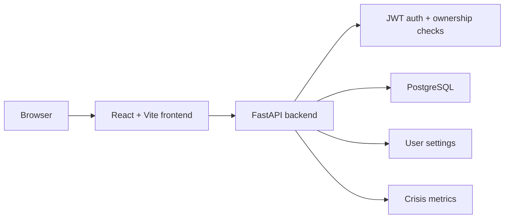

# CyberLab Tracker

<p align="center">
  
</p>

<p align="center">
  <a href="https://github.com/worhels/CyberLab-Tracker/actions/workflows/ci.yml">
    
  </a>
  <a href="https://github.com/worhels/CyberLab-Tracker/actions/workflows/codeql.yml">
    
  </a>
  
  
  
  
</p>

<p align="center">
  <strong>Local-first academic workload tracker with a security-minded backend and a dark visual control-room interface.</strong>
</p>

<p align="center">
  <a href="#quick-start">Quick Start</a>
  |
  <a href="#system-map">System Map</a>
  |
  <a href="#security-posture">Security</a>
  |
  <a href="#roadmap">Roadmap</a>
</p>

> A quiet control room for labs, deadlines, debts, and the moment everything starts blinking red.

## Signal

CyberLab Tracker is a full-stack local-first study workspace built with
FastAPI, PostgreSQL, React, TypeScript, Docker, and GitHub Actions.

The app turns academic noise into a readable pressure map: subjects, tasks,
deadlines, debt, progress, crisis priority, and visual workload state all live in
one place. The current UI direction is Zerkalo-first: dark, restrained,
monochrome-heavy, slightly strange, and made to feel like a personal command
center instead of a generic dashboard.

```txt
STATUS      local-first / portfolio-ready / daily-use capable
BACKEND     FastAPI + SQLAlchemy + Alembic + JWT ownership checks
FRONTEND    React + TypeScript + Vite + visual workload scenes
DATABASE    PostgreSQL 16
VIBE        graphite UI, pressure fields, soft motion, crisis mode
```

## What It Does

| Surface | Built |
| --- | --- |
| Auth | Email/password login, JWT access tokens, protected routes |
| Subjects | CRUD with teacher, semester, color, and description |
| Tasks | CRUD with status, priority, type, deadline, estimates, links, and reports |
| Dashboard | Progress, nearest deadline, priority queue, subject progress, recent activity |
| Tasks Workspace | Search, priority/type filters, list modes, pagination, animated rows |
| Crisis Mode | Ranked active tasks, pressure score, cohesion score, instability score |
| Visuals | Crisis Volume Cube, workload sphere, subject hotspots, pressure-field backgrounds |
| Settings | Language, theme, accent, dashboard density, reduced motion, visual toggles |

## Current Build

As of June 25, 2026, the project includes:

- Authenticated app shell with collapsible desktop sidebar and mobile navigation
- Dashboard, Subjects, Tasks, Crisis Mode, and Settings pages
- Persisted user settings API and frontend settings context
- Russian, Ukrainian, and English labels for the app shell/settings flow
- Zerkalo, dark, light, and system theme support
- Light-theme normalization so the dark scene layer does not leak into light UI
- Demo seed data for local review
- Unit coverage for JWT claims, token validation behavior, crisis metrics, and
  user settings defaults/updates

Fresh screenshots are still pending. The screenshot pass should happen after the
current UI polish is visually verified on desktop and mobile.

## System Map



More detail lives in [docs/ARCHITECTURE.md](docs/ARCHITECTURE.md).

## Stack

| Area | Stack |
| --- | --- |
| Backend | FastAPI, SQLAlchemy 2, Alembic, Pydantic |
| Database | PostgreSQL 16 |
| Frontend | React, TypeScript, Vite, React Router |
| UI and visuals | Tailwind CSS, design tokens, Three.js, React Three Fiber, Framer Motion, Lucide |
| Tooling | Docker Compose, PowerShell scripts, GitHub Actions |
| Security | JWT auth, bcrypt hashing, CORS policy, auth rate limiting, ownership checks |

## Security Posture

CyberLab Tracker is intentionally not framed as an enterprise SaaS. The security
scope is practical hardening for a realistic full-stack productivity app:

- JWT validation with explicit algorithm and required claims
- bcrypt password hashing
- generic authentication errors
- login/register rate limiting
- explicit CORS configuration
- Docker secret handling
- API docs disabled outside debug mode
- IDOR prevention through per-user data access checks
- documented threat model and known boundaries

Read more:
[SECURITY.md](SECURITY.md),
[docs/SECURITY_MODEL.md](docs/SECURITY_MODEL.md),
[docs/THREAT_MODEL.md](docs/THREAT_MODEL.md).

## Quick Start

Run everything from the project root:

```powershell
.\scripts\dev.ps1
```

If PowerShell blocks local scripts:

```powershell
powershell -ExecutionPolicy Bypass -File .\scripts\dev.ps1
```

The script will:

- create `.env` and `frontend/.env` when missing
- generate local `POSTGRES_PASSWORD` and `JWT_SECRET_KEY` values
- start PostgreSQL and the FastAPI backend with Docker Compose
- apply Alembic migrations
- seed the demo user and demo data
- install frontend dependencies
- start the Vite frontend

Open:

- App: [http://localhost:5173](http://localhost:5173)
- API health: [http://localhost:8000/health](http://localhost:8000/health)

Demo account:

- Email: `demo@cyberlab.dev`
- Password: `password123`

## Environment

Root `.env` is created from `.env.example`.

| Variable | Purpose |
| --- | --- |
| `POSTGRES_DB` | Local PostgreSQL database name |
| `POSTGRES_USER` | Local PostgreSQL user |
| `POSTGRES_PASSWORD` | Required local database password |
| `BACKEND_PORT` | Host port for the backend container |
| `DEBUG` | Enables API docs when `true` |
| `JWT_SECRET_KEY` | Required signing secret for JWT tokens |
| `JWT_ALGORITHM` | JWT signing algorithm |
| `ACCESS_TOKEN_EXPIRE_MINUTES` | Access token lifetime |
| `CORS_ORIGINS` | Allowed frontend origins |

Frontend `.env` is created from `frontend/.env.example` and contains:

```env
VITE_API_BASE_URL=http://localhost:8000/api/v1
```

## Development

Useful local commands:

```powershell
.\scripts\dev.ps1 -ResetDb
.\scripts\dev.ps1 -NoSeed
.\scripts\dev.ps1 -SkipInstall
.\scripts\dev.ps1 -BackendOnly
```

Frontend checks:

```powershell
cd frontend
npm ci
npm run typecheck
npm run lint
npm run build
```

Backend checks:

```powershell
cd backend
python -m pip install -r requirements-dev.txt
ruff check .
pytest
```

More detail: [docs/DEVELOPMENT.md](docs/DEVELOPMENT.md).

## Quality Gates

GitHub Actions runs:

- backend dependency install
- Ruff check
- backend tests
- backend compile check
- frontend dependency install
- TypeScript typecheck
- frontend lint
- frontend production build
- CodeQL analysis
- dependency review on pull requests

## API Docs

API docs are only enabled when `DEBUG=true`.

Set this in `.env`:

```env
DEBUG=true
```

Restart backend:

```powershell
docker compose restart backend
```

Then open:

- Swagger UI: [http://localhost:8000/docs](http://localhost:8000/docs)
- OpenAPI JSON: [http://localhost:8000/openapi.json](http://localhost:8000/openapi.json)

## Roadmap

Current focus:

- destructive-action confirmations
- deadline quick filters
- broader auth/ownership integration tests
- final screenshots for the repository
- small UI polish and visual performance fallback work

See [ROADMAP.md](ROADMAP.md).

## Repository Docs

- [Architecture](docs/ARCHITECTURE.md)
- [API overview](docs/API_OVERVIEW.md)
- [Development guide](docs/DEVELOPMENT.md)
- [Branching model](docs/BRANCHING.md)
- [GitHub setup](docs/GITHUB_SETUP.md)
- [Security model](docs/SECURITY_MODEL.md)
- [Threat model](docs/THREAT_MODEL.md)

## License

This project is released under the MIT License. See [LICENSE](LICENSE).
