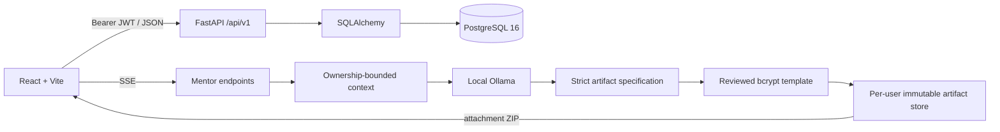

# Architecture

CyberLab Tracker is a local-first full-stack application. The FastAPI backend is
the authority for identity, ownership, persistence, timestamp normalization,
dashboard metrics, and Crisis ranking. The React frontend owns interaction,
local-date presentation, responsive layout, and optional WebGL visuals.

## Runtime view

Docker Compose starts PostgreSQL and the API. Vite runs separately for local
development. The backend reads configuration from environment variables; the
frontend reads only the public `VITE_API_BASE_URL`.

## Backend boundaries

The backend lives in `backend/app`.

| Area | Responsibility |
| --- | --- |
| `api/v1/endpoints` | HTTP validation, authentication dependencies, status codes |
| `crud` | Ownership-scoped queries and transaction boundaries |
| `models` | SQLAlchemy entities, relationships, and persisted enums |
| `schemas` | Pydantic request/response contracts |
| `core` | Settings, JWT, and password hashing |
| `services` | Reviewed artifact rendering, integrity metadata, private ZIP storage |
| `db` | Engine, sessions, and declarative metadata |
| `alembic/versions` | Forward and reverse PostgreSQL schema changes |

Core entities:

- `User` owns subjects and settings.
- `Subject` owns tasks and is unique by `(user_id, name)`.
- `Task` stores study work and references a subject.
- `UserSettings` stores language, theme, density, motion, and reminder choices.
- `MentorMessage` stores completed mentor exchanges with optional owned task or
  subject context.

Task ownership is indirect: every task read or mutation joins `Subject` and
filters `Subject.user_id`. A caller cannot gain access by guessing an ID.

## API contracts

- Request timestamps must include an offset. They are normalized to UTC before
  persistence and serialized as offset-aware ISO 8601 values.
- Local calendar grouping is a frontend presentation concern.
- Omitted update fields remain unchanged.
- Nullable metadata can be explicitly cleared with JSON `null`.
- Required fields may be omitted from an update, but an explicit `null` is
  rejected with `422`.
- Delete endpoints return `204`; missing or foreign resources return the same
  `404` shape.

The update routes retain their existing `PUT` paths for compatibility but use
patch semantics. The contract is documented explicitly in
[API_OVERVIEW.md](API_OVERVIEW.md).

## Authentication

Passwords are hashed directly with bcrypt. The configured cost is validated,
and registration rejects passwords beyond bcrypt's 72-byte input boundary so
two distinct inputs cannot collapse to the same effective password.

Access tokens use a fixed `HS256` algorithm, a secret of at least 32
characters, and required `sub`, `exp`, `iat`, and `type` claims. Token
payloads are not trusted until signature, algorithm, required claims, token
type, and user state have all been validated.

## Crisis Mode

The backend ranks unfinished work using:

- debt status
- overdue and near-deadline windows
- priority
- estimated effort
- task type
- current progress status

`debt`, `not_started`, `in_progress`, and `submitted` are active Crisis
states. `accepted` is complete. Metrics are calculated from the complete owned
task set while the default ranked response excludes accepted work.

The visualization is optional. Reduced-motion settings and system preferences
disable continuous animation; lower-capability/mobile devices use a reduced
quality tier.

## Frontend boundaries

The frontend lives in `frontend/src`.

| Area | Responsibility |
| --- | --- |
| `api` | Typed HTTP clients and bearer-token transport |
| `pages` | Route data loading and page composition |
| `components` | CRUD forms, dialogs, cards, navigation, and visuals |
| `context` | Auth and persisted settings state |
| `utils` | Date conversion, calendar grouping, filtering, formatting |
| `styles` | Design tokens, themes, responsive rules, reduced motion |

Routes are lazy-loaded behind `ProtectedRoute`: Dashboard, Subjects, Tasks,
Calendar, Crisis, and Settings. CRUD forms are extracted from route components
so create/edit state and nullable-field normalization are shared and testable.

Calendar groups tasks by the user's local calendar day, highlights today and
overdue work, and keeps tasks without a deadline in a separate group. It is not
an external calendar integration.

## CyberMentor

The browser sends the current page and optional task/subject hints. The backend:

1. authenticates the user;
2. resolves optional IDs through ownership-scoped queries;
3. detects intent and selects only the required bounded context;
4. sends that context to the configured local Ollama endpoint;
5. streams tokens over SSE;
6. persists only completed exchanges.

The model has no database access. Prompt content is untrusted data and does not
override authorization boundaries.

### Reviewed artifact flow

The reviewed artifact endpoint is separate from chat and supports only
`bcrypt-timing-web-v1`. The backend:

1. authenticates the caller and resolves an optional owned task before Ollama;
2. asks the configured model for a closed JSON specification containing only a
   title, description, and allowlisted bcrypt rounds;
3. replaces unsupported model claims with reviewed copy and renders an exact,
   server-owned file set;
4. writes the files atomically to a per-user immutable directory outside the
   source tree and records SHA-256 metadata, prompt hash, model name, and model
   digest when available;
5. exposes metadata and a small authenticated ZIP download. Generated HTML and
   JavaScript are never served inline by CyberLab.

There is no generic file tool, repository write, shell, package installation,
or model-selected command. The bcrypt prototype is trusted application code,
not arbitrary model output. Normal CI mocks Ollama; the opt-in `ollama` pytest
marker exercises the real model-to-spec-to-files-to-bcrypt path locally.

## Quality and migration gates

Pull requests run:

- Ruff, strict Pyright, pytest, and Python compilation;
- strict TypeScript, Vitest, ESLint, and a production Vite build;
- PostgreSQL 16 Alembic upgrade, model parity check, downgrade, and re-upgrade;
- CodeQL and dependency review.

SQLite remains useful for fast API regression tests, but it is not considered a
substitute for the PostgreSQL migration job.

## Deployment boundary

The repository is ready for local use and controlled beta evaluation. A public
internet deployment requires infrastructure not provided here: TLS termination,
trusted proxy configuration, persistent distributed rate limiting, centralized
logs/metrics, backups and restore testing, secret management, and a privacy/data
retention policy.
