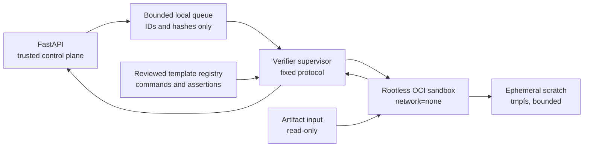

# Mentor verifier design

Status: design baseline. The verifier is not implemented or enabled.

## Purpose and scope

The verifier is a separate local worker for future reviewed CyberMentor
templates that need executable checks. It must never turn the API process into
a general code runner.

The existing `bcrypt-timing-web-v1` template remains render-only and does not
need this worker. A new executable template can be enabled only after its fixed
verification recipe and expected outputs are reviewed and added to a
server-owned registry.

The verifier accepts an artifact identity, not a command supplied by a user or
model. It returns bounded test results and never returns arbitrary files.

## Security invariants

Every verification run must satisfy all of these invariants:

- the API, Ollama, user, and model cannot select an executable, argument,
  environment variable, mount, image, or output path;
- the runner and workload use an unprivileged user and cannot become root;
- external network access is absent; loopback is available only inside the
  isolated sandbox when a reviewed test recipe needs it;
- the root filesystem and artifact input are read-only;
- the only writable mount is a fresh size-limited temporary directory;
- Linux capabilities are empty and `no_new_privileges` is active;
- process count, memory, CPU, wall-clock time, output bytes, and file count are
  bounded;
- the result is linked to the exact artifact manifest and runner image digest;
- a failed capability self-test disables verification instead of falling back
  to execution in the API process or host shell.

## Trust boundaries



The API is a control plane only. The supervisor is a separately packaged
process with no database or JWT secret. The sandbox receives no credentials,
Docker socket, repository checkout, user home directory, Ollama endpoint, or
host-writable mount.

## Request contract

The API writes a versioned request over a length-bounded local IPC channel:

```json
{
  "protocol_version": 1,
  "request_id": "opaque UUID",
  "user_id": 42,
  "artifact_id": "opaque UUID",
  "template_id": "reviewed-template-v1",
  "artifact_manifest_sha256": "64 lowercase hex characters"
}
```

`user_id` is used only for ownership revalidation and audit correlation. It is
not exposed inside the sandbox.

The supervisor resolves the following values from its signed, server-owned
template registry:

- immutable runner image digest;
- fixed executable and argument array;
- maximum wall time, CPU, memory, processes, output, and scratch size;
- exact input file allowlist and per-file hashes;
- permitted result files and their parsers;
- success assertions.

Unknown protocol versions, templates, files, hashes, and registry values fail
closed before a sandbox is created.

## Result contract

The verifier returns one bounded result:

```json
{
  "protocol_version": 1,
  "request_id": "opaque UUID",
  "artifact_manifest_sha256": "64 lowercase hex characters",
  "runner_image_digest": "sha256:...",
  "status": "passed",
  "checks": [
    {
      "id": "unit-tests",
      "status": "passed",
      "summary": "12 checks passed"
    }
  ],
  "duration_ms": 1840,
  "truncated": false
}
```

Allowed statuses are `passed`, `failed`, `timed_out`, `rejected`, and
`runner_error`. Check IDs and summaries are template-defined and length
limited. Raw stdout, stderr, generated HTML, stack traces, and arbitrary
filesystem output are not returned to the browser.

## Sandbox profile

The reference implementation is a rootless OCI runtime on Linux. Each run
uses:

- a pinned image digest with no package manager or shell when the recipe does
  not require one;
- numeric non-root UID/GID `65532:65532`;
- `network=none`, an empty DNS configuration, and no host networking;
- read-only root filesystem;
- `/input` mounted read-only from a newly staged, hash-verified directory;
- `/scratch` as a fresh `tmpfs` with a template-specific size limit;
- all capabilities dropped, `no_new_privileges`, and the runtime's default
  seccomp profile tightened where the language permits;
- a low PID limit, memory limit with swap disabled, CPU quota, and hard wall
  timeout;
- a fixed working directory and minimal fixed environment;
- a direct argument vector with no shell interpolation.

The supervisor kills the complete sandbox/process group on timeout,
disconnect, or protocol failure, then removes the staged input and scratch
space.

## Platform policy

The runner performs a startup capability self-test and reports:

- effective non-root runtime ownership;
- workload UID/GID;
- network namespace isolation;
- read-only mounts;
- capability and `no_new_privileges` state;
- enforcement of PID, memory, output, and timeout limits.

Linux is supported only when all checks pass. Windows and macOS may use a
local VM-backed container engine only after the same properties are attested
inside the runner. A plain subprocess, Windows job object alone, unrestricted
Docker daemon, or process running inside the FastAPI container is not an
accepted fallback.

When the required runner is unavailable, the UI/API reports verification as
unavailable. Artifact creation and download remain usable.

## Verification lifecycle

1. The API authenticates the user and rechecks artifact ownership.
2. The API recomputes the immutable artifact manifest hash.
3. A bounded queue accepts at most one active and a small fixed number of
   pending local jobs per user.
4. The supervisor resolves the reviewed recipe and repeats manifest checks.
5. Files are copied into a new staging directory using allowlisted relative
   paths; links and special files are rejected.
6. The supervisor runs the capability self-test, then creates the sandbox.
7. The fixed recipe executes under all resource limits.
8. The supervisor parses only allowlisted result files and emits the bounded
   result contract.
9. Staging and scratch data are removed regardless of outcome.
10. The API stores the result with the artifact hash and runner digest. A
    changed artifact cannot reuse an earlier result.

## Acceptance tests

Implementation is not complete until automated tests prove:

- an unknown template, command, argument, path, environment key, or image is
  rejected before execution;
- path traversal, symlinks, hard links, devices, sockets, and oversized files
  are rejected;
- reads outside `/input` and writes outside `/scratch` fail;
- outbound IPv4, IPv6, DNS, and host-service connection attempts fail;
- privilege escalation, namespace creation, and access to the container
  runtime socket fail;
- fork bombs, memory pressure, endless output, and infinite loops hit their
  independent limits and leave no child processes;
- malformed or oversized IPC and result payloads fail closed;
- a timeout or supervisor crash removes temporary data;
- foreign artifact IDs remain indistinguishable from missing IDs;
- the result artifact hash and runner digest are reproducible and auditable.

These tests must run against the actual selected runtime, not a mock. Unit
tests may cover registry and protocol parsing separately.

## Non-goals and residual risks

The verifier does not support arbitrary repository editing, user-selected
commands, package installation, network-dependent tests, or general-purpose
AI agents.

Container isolation reduces risk but is not a formal proof against kernel or
runtime vulnerabilities. The runner image and runtime remain supply-chain
dependencies and must be pinned, scanned, and updated. New language runtimes
or templates require a separate review of syscalls, resource behavior, and
result parsing before being added to the registry.
