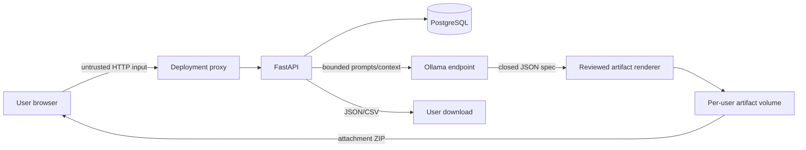

# Threat model

## System and trust boundaries

In local development the proxy boundary may be absent. For public hosting it is
mandatory and must terminate TLS, set security headers, enforce body limits,
and forward client identity only through a trusted configuration.

## Assets

| Asset | Primary risk |
| --- | --- |
| Password hashes | Offline cracking or truncation ambiguity |
| JWT signing secret | Account impersonation |
| Bearer token | Theft, replay, or XSS exfiltration |
| Subject/task/settings data | IDOR, injection, or unintended export |
| Mentor messages | Sensitive-text disclosure or prompt injection |
| Mentor artifacts | Cross-user download, path escape, tampering, generated XSS |
| Database credentials/backups | Full data compromise |
| CI and release credentials | Supply-chain compromise |

## Actors

- unauthenticated internet attacker;
- authenticated user probing another user's IDs;
- malicious or compromised dependency;
- attacker controlling text stored in tasks or Mentor prompts;
- accidental operator/developer error;
- compromised browser through XSS or extension access.

## Threats and controls

### Authentication confusion

Threats: weak secret, algorithm substitution, missing claims, malformed subject,
bcrypt input truncation, or user enumeration.

Controls:

- fixed `HS256` allow-list and minimum 32-character secret;
- required `sub`, `exp`, `iat`, and `type` claims;
- active-user lookup after token validation;
- direct bcrypt with validated cost and a 72-byte registration boundary;
- dummy verification and generic login errors;
- regression tests for malformed/expired/wrong-type tokens and password limits.

Residual risk: bearer tokens are replayable until expiry and there is no token
revocation or recovery flow.

### Broken object-level authorization (IDOR)

Threat: change a numeric task or subject ID to read or mutate another account.

Controls: all task queries join the owned subject; subject, settings, dashboard,
export, and Mentor queries filter by the current user; missing and foreign IDs
both return `404`; ownership regressions cover read/write/delete paths.

### XSS and token theft

Threat: script execution reads the access token from `localStorage`.

Controls: React escaping, no automatic execution of model/task content, typed
rendering, and development CSP. Mentor artifacts are downloaded as attachments
with `no-store`/`nosniff`; their HTML and JavaScript are never previewed on the
authenticated CyberLab origin.

Residual risk: localStorage remains reachable to successful XSS and the Vite
development CSP is not a production policy. Public hosting needs a strict proxy
CSP and a reviewed cookie/token design.

### Brute force and denial of service

Threats: repeated auth attempts, expensive bcrypt work, large API bodies, long
Mentor streams, or WebGL resource pressure.

Controls: auth rate limit, bounded schemas/context, Ollama timeout, artifact
file/total/count limits, a single artifact-generation semaphore, user/system
reduced-motion fallback, mobile quality tier, and server-side Crisis limits.

Residual risk: the auth limiter is in-memory and process-local. Distributed
limiting, reverse-proxy request limits, quotas, and monitoring are required for
public exposure.

### Prompt injection and model boundary failure

Threat: task text or user prompts instruct the model to reveal unrelated data or
perform unsafe actions.

Controls: ownership is enforced before context creation; context is bounded;
Ollama has no direct database/repository access; chat output is displayed as
text and not executed; incomplete streams are not persisted. The artifact API accepts
one template and a strict request, asks Ollama only for a closed specification,
replaces unsupported claims with reviewed copy, and renders code from a trusted
server template. The model cannot select paths, commands, dependencies, shell
arguments, or environment variables.

Residual risk: model output can be incorrect or socially persuasive, and a
remote Ollama-compatible URL would receive prompt data.

### Artifact isolation and integrity

Threats: traversal or symlink escape, overwriting an existing artifact, reading
another user's UUID, tampering after generation, generated same-origin XSS,
password disclosure, or using the backend as a code runner.

Controls: per-user directories and server UUIDs; exact paths rather than an
extension allowlist; private permissions; exclusive file creation and atomic
directory rename; immutable revisions; strict ownership; exact file-set,
regular-file, size, and SHA-256 verification before reads; attachment-only ZIP
delivery; no preview endpoint; no generic executor or package manager. The
reviewed bcrypt app caps UTF-8 password input at 72 bytes, redacts invalid
input, permits rounds 10–13, serializes hash work, and never returns the password
or digest.

Residual risk: filesystem permissions are platform-dependent, the artifact
quota is local to one installation, downloaded code can be run unsafely by the
user, and the verifier supports only the reviewed bcrypt template. A generic AI
coding agent remains out of scope.

The implemented local verifier follows the worker boundary, fail-closed
platform policy, resource controls, and runtime attestation described in
[the Mentor verifier design](MENTOR_VERIFIER_DESIGN.md). It is a local CLI,
not a generic API execution facility.

### Export/privacy leakage

Threat: another user's data appears in an export, a shared proxy caches it, or a
download is later exposed.

Controls: export queries are ownership-scoped and filenames use authenticated
responses. Public deployment must add `Cache-Control: no-store` at the
application or proxy boundary and publish data handling/retention rules.

### Time and nullable contract ambiguity

Threat: naive timestamps are interpreted differently across machines, or JSON
`null` corrupts a required database column.

Controls: offset-aware input is required and normalized to UTC; optional
metadata supports deliberate clearing; required update fields reject explicit
`null`; PostgreSQL migration and API regression jobs exercise the contract.

### Supply chain and migrations

Threats: vulnerable dependencies, malicious package update, schema drift, or an
irreversible release migration.

Controls: lockfile for npm, dependency review, Dependabot, CodeQL, package
audits, strict type checks, and a PostgreSQL job that upgrades, checks parity,
downgrades, and upgrades again.

Residual risk: Python requirements use compatible ranges rather than a
fully-hashed lock. Release operators should build immutable artifacts and record
resolved dependencies.

### Secrets and CI

Threat: real secrets enter Git history, logs, images, or workflow output.

Controls: ignored `.env` files, required runtime variables, test-only CI
secrets, secret scanning/push protection, and no production secret defaults.

## Accepted beta limitations

- no email verification, password recovery, MFA, or external OAuth;
- no distributed session revocation;
- no production reverse-proxy configuration in this repository;
- no formal privacy/retention policy;
- no guarantee that optional third-party assets or local model weights share
  the project's MIT license.
- no arbitrary AI repository editing or generated-code execution service.
